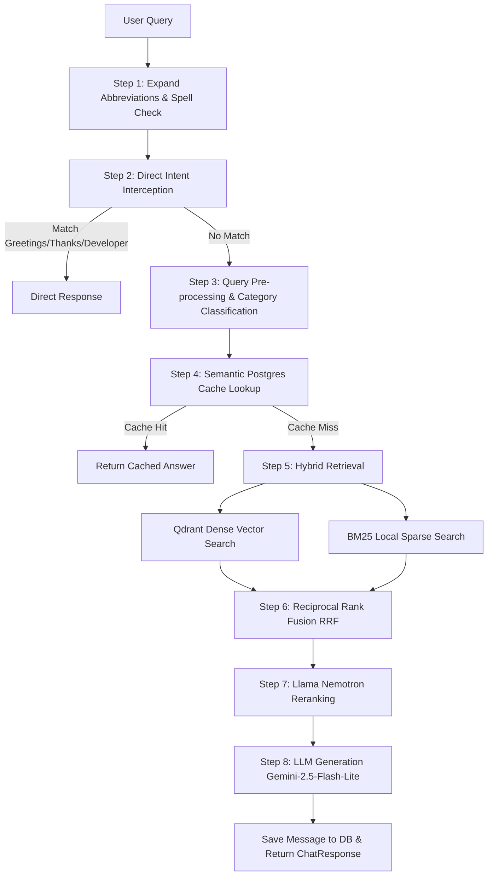

# MSAJCE Chatbot (Lorin AI) – End-to-End Pipeline & Architecture Specifications

This document provides a detailed, high-level architectural overview of the Mohamed Sathak A.J. College of Engineering (MSAJCE) Chatbot system, explaining the infrastructure, ingestion pipelines, query workflows, and evaluation systems.

---

## 1. Technical Stack & Infrastructural Layout

### Frontend Architecture
- **Core Framework**: React 18+ with TypeScript (Vite-scaffolded).
- **Styling**: TailwindCSS utility framework alongside customized Vanilla CSS selectors for interactive hover and focus states.
- **Animations**: Framer Motion for smooth message entry, typing state indicators, and bubble scaling.
- **Session Identity**: Automatic UUID v4 client-side generator stored in the browser's local storage (`msajce_chat_session_id`) to track multi-turn conversations.

### Backend Services
- **Application Framework**: FastAPI (ASGI) running on Python 3.10+.
- **ASGI Server**: Uvicorn.
- **Rate Limiting**: Token-bucket rate limits using the Slowapi library:
  - Chat queries (`/api/chat`): 10 queries per minute, 25 queries per day.
  - User feedback (`/api/feedback`): 10 queries per minute.

### Database & Vector Engine
- **Relational Storage**: Cloud-hosted PostgreSQL (via Supabase) utilizing pgBouncer for high-frequency connection pooling.
- **Vector Database**: Qdrant Cloud Cluster. Matches embeddings in a single collection named `college_knowledgebase`.
  - **Payload Indexes**: Registered on `source_file`, `category`, and `entity_ids` as keyword indexes for fast metadata filtering.

### LLMs & API Gateways
- **Generation models**:
  - Primary: Google Gemini 2.5 Flash Lite (routed via Vercel AI Gateway).
  - Fallback: Meta Llama 3.1 70B Instruct (NVIDIA NIM).
- **Dense Embedding model**: NVIDIA NIM (`nvidia/nv-embedqa-e5-v5`, 1024 dimensions, 512 token max input limit).
- **Re-ranking model**: NVIDIA NIM (`nvidia/llama-nemotron-rerank-1b-v2`).

---

## 2. Ingestion & Semantic Chunking Pipeline

### Dataset Properties
- **Source Files**: 52 structured Markdown (`.md`) files covering college administration, departments, hostel, transport, admissions, sports, and placement.
- **Ingestion Scale**: 1692 total chunks generated and upserted into Qdrant Cloud.

### Chunking Parameters
- **Chunking Method**: Semantic Parent-Child Chunking.
  - **Child Chunk Target (Soft)**: 600 characters (~150 tokens) – used for precise vector mapping.
  - **Child Chunk Maximum (Hard)**: 900 characters (~225 tokens) to fit inside the tight 512 token limit of the embedding model.
  - **Child Chunk Minimum (Hard)**: 60 characters.
  - **Overlap range**: 60 to 100 characters.
  - **Tables Preservation**: Markdown tables up to 1800 characters are preserved as single chunks to avoid breaking structural context.
- **Metadata Tagging**: Each chunk is tagged with `source_file`, `page_number`, `section_title`, and `category` (from 22 pre-defined categories).

---

## 3. Relational Database Schema Descriptions

The PostgreSQL database maintains five main tables to persist conversation history, track performance, and handle caching:

### 1. Chat Sessions Table (`chat_sessions`)
- **Purpose**: Tracks active user sessions.
- **Fields**: Session UUID (Primary Key), User ID (Defaults to anonymous), Session Title, and Creation Timestamp.

### 2. Chat Messages Table (`chat_messages`)
- **Purpose**: Persists every user and assistant message.
- **Fields**: Message UUID (Primary Key), Session UUID (Foreign Key), Role (User/Assistant), Message Content, Prompt Tokens, Completion Tokens, Citations JSON list, and Creation Timestamp.

### 3. Message Feedback Table (`message_feedback`)
- **Purpose**: Records thumbs-up/down ratings from users.
- **Fields**: Message UUID (Primary Key, Foreign Key), Session UUID, Rating Value (+1 for like, -1 for dislike), and Creation Timestamp.

### 4. Feedback Self-Healing Correction Log Table (`feedback_correction_log`)
- **Purpose**: Audit log tracking automated cache corrections.
- **Fields**: Log UUID (Primary Key), Message UUID, Session UUID, User Query, Original Answer, Verdict (Real QA Mismatch vs User Dissatisfaction), Reason, Corrected Answer, Cache Updated Status, and Creation Timestamp.

### 5. Semantic Cache Table (`query_cache`)
- **Purpose**: Stores high-confidence answers to avoid redundant LLM generation.
- **Fields**: Query Hash (SHA-256 of normalized text, Primary Key), Normalized Query Text, Response Text, Citations JSON list, and Creation Timestamp.

---

## 4. End-to-End Query Handling Pipeline

When a client queries the chat endpoint, the request moves through these phases:

### Step 1: Preprocessing & Normalization
- **Expansion**: Expands abbreviations (e.g., "cse admissions" becomes "computer science engineering admissions").
- **Levenshtein Distance Spellcheck**: Corrects typos using a custom vocabulary built from the database tokens combined with static proper nouns. It computes candidate edits within a distance threshold of 2.

### Step 2: Multi-Turn Context Rewriting
If the current session contains previous messages, the query is passed to a rewriter LLM to resolve pronouns (e.g. "which bus goes there?" is rewritten into an independent search string like "Which bus goes to Vepery?").

### Step 3: Classification & Metadata Filtering
The rewritten query is classified into a target category. If confidence exceeds the 60% threshold, a keyword filter is generated to restrict the subsequent vector search space.

### Step 4: Semantic Cache Lookup
The query is lowercased, spaces are stripped, punctuation is removed, and it is hashed using SHA-256. If the hash exists in the cache table, the response and citations are immediately returned (0ms retrieval latency).

### Step 5: Parallel Hybrid Retrieval
If a cache miss occurs, the system executes two search threads in parallel:
1. **Dense Semantic Search**: Generates a 1024-dimensional query embedding via NVIDIA's embedding model and searches Qdrant using Cosine Similarity, applying the category filters.
2. **Sparse Keyword Search**: Queries the local BM25 index built from the dataset vocabulary using the BM25 algorithm.

### Step 6: Reciprocal Rank Fusion (RRF)
The results from Dense and Sparse searches are combined. The RRF score for each document is calculated as the sum of reciprocal ranks across both search methods, using a smoothing constant of 60. The top 40 candidates are selected.

### Step 7: Re-ranking
The fused candidates are passed through the Llama Nemotron Reranker to select the 6 most relevant context blocks.

### Step 8: Contextual Generation & Redaction
The top 6 context blocks are constructed into a prompt. Stricly grounded context instructions are enforced, formatting schedules and lists into Markdown Tables. Post-generation regex checks strip leaked entity comment tags and personal phone numbers.

---

## 5. Thumbs-Down Feedback & Self-Healing Loop

If a user dislikes a generated answer (thumbs-down / rating -1):
1. **Immediate Purge**: The cache is evicted for the exact user query hash. Additionally, a fuzzy deletion is executed matching the first 40 characters of the query text to clear legacy cache versions.
2. **LLM Judge Audit**: The backend launches a background task that calls Llama 3.1 8B Instruct as a Judge. The judge compares the user query, assistant response, and actual retrieved reference context.
3. **Verdict Classification**:
   - `USER_DISSATISFACTION_OR_FUN`: The response was factually correct, but the user is unhappy with the policy (e.g. fee is high, warden rules). No correction is made.
   - `REAL_QA_MISMATCH`: The response contradicts the context, contains incorrect figures, or missed critical facts.
4. **Self-Correction**: If classified as a real mismatch, a fresh hybrid retrieval is executed, a highly accurate corrected answer is synthesized by the LLM, and it is cached to override future queries. The audit log is recorded in the PostgreSQL correction log.

---

## 6. RAGAS Offline Evaluator

To monitor pipeline quality offline, a custom evaluator tests the live system against a benchmark dataset:
- **Mechanism**: LLM-as-a-judge pipeline using Llama 3.1 70B Instruct as the judge and NVIDIA embeddings for calculating answer embedding dimensions.
- **Metrics Tracked**:
  - **Faithfulness**: Measures whether all facts stated in the answer are strictly supported by the retrieved context.
  - **Answer Relevancy**: Measures how directly the generated response addresses the initial user question.
  - **Factual Correctness**: Evaluates accuracy against expected ground-truth answers.
- **Execution**: Can be run from anywhere (local laptop or CI/CD pipelines) against the live cloud Railway server, outputting logs to a local JSON file.
