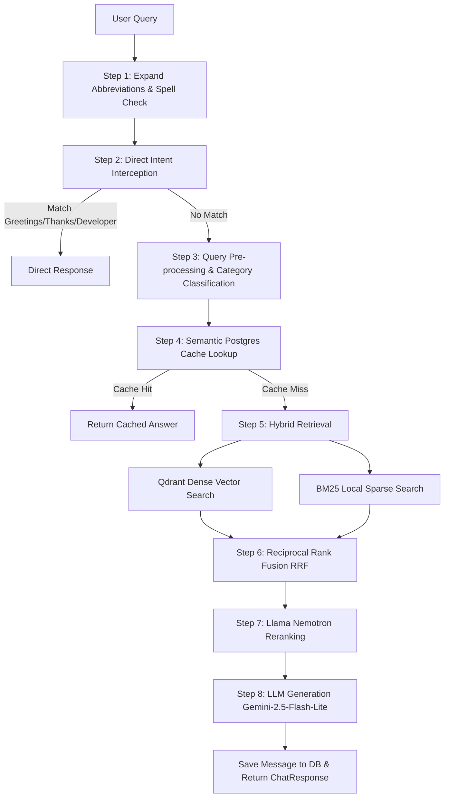

# MSAJCE Chatbot (Lorin AI) – Pipeline & Architecture Specifications

This document outlines the end-to-end technical specifications, tech stack, data ingestion pipeline, retrieval architecture, and evaluation suite for the Mohamed Sathak A.J. College of Engineering (MSAJCE) Chatbot.

---

## 1. Technical Stack Overview

### Frontend
- **Core Framework**: React 18+ with TypeScript
- **Styling**: TailwindCSS & Vanilla CSS
- **Interactions**: Framer Motion for animations (smooth message bubbling, transitions)
- **Deployment**: Vercel / Railway

### Backend
- **Core Framework**: FastAPI (Python 3.10+)
- **WSGI/ASGI Server**: Uvicorn
- **Rate Limiting**: Slowapi (limits set to 10 queries/minute, 25 queries/day for chat; 10/minute for feedback)
- **Database**: PostgreSQL (Supabase Cloud-hosted) for chat sessions, message persistence, feedback, and audit logs.
- **Vector Database**: Qdrant Cloud (utilizing the `college_knowledgebase` collection)

### Models & Gateways
- **Generation**: Vercel AI Gateway (Primary: `google/gemini-2.5-flash-lite`) with NVIDIA NIM (Fallback: `meta/llama-3.1-70b-instruct`)
- **Embeddings**: NVIDIA NIM (`nvidia/nv-embedqa-e5-v5`, 1024-dimensional space)
- **Re-Ranking**: NVIDIA NIM (`nvidia/llama-nemotron-rerank-1b-v2`)

---

## 2. Ingestion & Chunking Pipeline (`process_dataset.py`)

### Dataset Properties
- **Source Files**: 52 structured Markdown (`.md`) files documenting college policies, bus routes, placement history, fees, research, and clubs.
- **Total Chunks**: **1692 chunks** generated and upserted into Qdrant Cloud.

### Chunking Strategy
- **Chunking Method**: Semantic Parent-Child Chunking.
  - **Child Chunk Target (Soft)**: 600 characters (~150 tokens) – used for precise vector mapping.
  - **Child Chunk Maximum (Hard)**: 900 characters (~225 tokens)
  - **Child Chunk Minimum (Hard)**: 60 characters
  - **Overlap range**: 60 to 100 characters
  - **Tables Preservation**: Markdown tables are treated differently; tables up to 1800 characters are preserved as single chunks to avoid breaking structural context.
- **Metadata Tagging**: Each chunk is tagged with `source_file`, `page_number`, `section_title`, and `category` (from 22 pre-defined categories).

---

## 3. Query Handling Flow (Step-by-Step)

When a user submits a query to `/api/chat`, the following steps execute sequentially:

### Step 1: Preprocessing & Normalization
- **Expansion**: Expand abbreviations (e.g. "cse" -> "Computer Science and Engineering", "hostel fee" -> "hostel fee structure").
- **Spellcheck**: Levinshtein-based spell checker corrects typos on key stops and names.

### Step 2: Direct Interception
- Bypasses RAG entirely for common intents (greetings, thanks, goodbyes, and developer attribution). Queries containing `"ramanathan"` or `"zendrum"` are instantly routed to the developer's bio card.

### Step 3: Classification
- The query is analyzed to predict the target category (e.g., "Transport", "Admission & Fees"). This generates metadata filters to narrow down the vector search scope.

### Step 4: Semantic Cache Check
- Queries are normalized and hashed. The Postgres database `query_cache` is queried. If a high-confidence exact or fuzzy match exists, it serves the cached response instantly (0ms retrieval latency).

### Step 5: Hybrid Retrieval
- **Dense Vector Search**: Qdrant queries the 1024-dimensional space using the query's NVIDIA embedding.
- **Sparse BM25 Search**: Matches exact keywords against a local index built from the dataset vocabulary (`vocab.pkl`).

### Step 6: Reciprocal Rank Fusion (RRF) & Re-ranking
- Combines vector search results and BM25 matches.
- Passes the top candidates through the **Llama Nemotron Reranker** to select the 6 most relevant contexts.

### Step 7: Generation
- Renders the context using strict formatting rules (e.g., tables for schedules, bullet points for criteria).
- Passes it to `google/gemini-2.5-flash-lite` via Vercel Gateway, falling back to NVIDIA NIM `llama-3.1-70b-instruct` if the gateway rate limit is hit.

---

## 4. Dislike Feedback & Self-Healing Pipeline

To guarantee accuracy, the bot features a self-correcting feedback loop:
1. **User Rating**: User clicks thumbs-down (`POST /api/feedback`, rating `-1`).
2. **Immediate Eviction**: The backend immediately purges the corresponding query from the semantic cache (`query_cache`).
3. **LLM Judge Audit**: A background worker spins up and calls `meta/llama-3.1-8b-instruct` (NVIDIA NIM) as a Judge. The judge compares the user query, assistant answer, and ground-truth retrieved sources.
4. **Verdicts**:
   - `USER_DISSATISFACTION_OR_FUN`: If the bot was factually correct but the user disliked the rule.
   - `REAL_QA_MISMATCH`: If the bot made a factual error or hallucinated.
5. **Auto-Healing**: If a `REAL_QA_MISMATCH` is found, the system synthesizes a high-accuracy corrected answer from fresh context, stores it in the cache to override the old answer, and writes an audit log to `feedback_correction_log`.

---

## 5. RAGAS Evaluation Pipeline (`eval/ragas_eval.py`)

A custom testing pipeline evaluates the pipeline offline (avoiding the fragile Python dependencies of the official Langchain `ragas` wrapper):
- **Mechanism**: LLM-as-a-judge scoring utilizing `meta/llama-3.1-70b-instruct` as the judge and `nv-embedqa-e5-v5` for query embeddings.
- **Metrics Tracked**:
  - **Faithfulness (0.0 - 1.0)**: Checks if the generated answer is strictly grounded in the retrieved context (no hallucination).
  - **Answer Relevancy (0.0 - 1.0)**: Evaluates if the answer directly addresses the question.
  - **Factual Correctness (0.0 - 1.0)**: Measures accuracy against expected ground-truth answers.
- **Output**: Generates a detailed audit log (`eval/ragas_results_<timestamp>.json`) detailing aggregate scores and category-by-category breakdowns.
